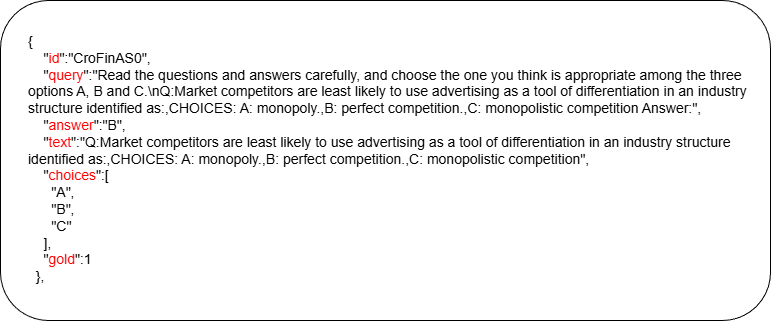
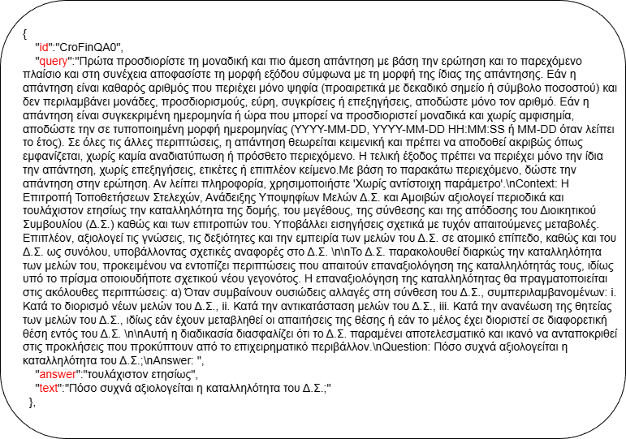
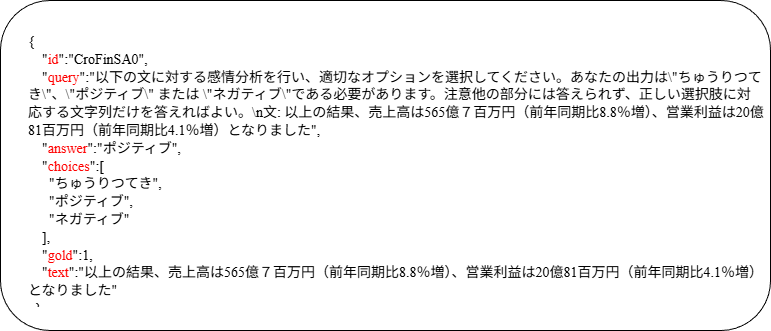
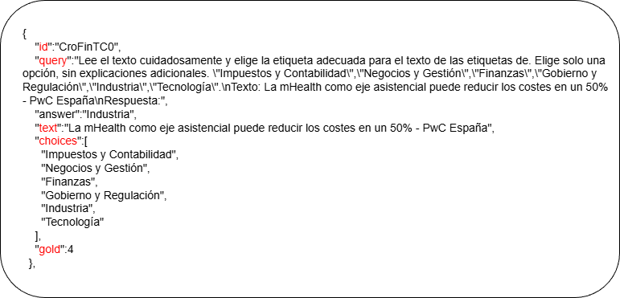
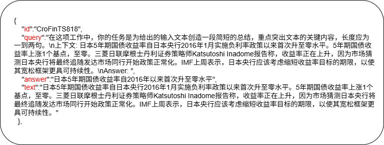

<p align="center">
  
</p>
<h1 align="center">CCL26-Eval-MapFinBen</h1>

# <p align="center"><font size=50><strong>[跨主流与低资源语言对齐的大模型金融评测-MapFinBen](http://www.cips-cl.org/static/CCL2025/cclEval/taskEvaluation/index.html#%E4%BB%BB%E5%8A%A17%E7%AC%AC%E4%B8%80%E5%B1%8A%E4%B8%AD%E5%9B%BD%E6%96%87%E5%AD%A6%E8%AF%AD%E8%A8%80%E7%90%86%E8%A7%A3%E8%AF%84%E6%B5%8B%EF%BC%88%E4%BA%89%E9%B8%A3%EF%BC%89)</strong></font></p>

<div align="center">

<table>
  <tr>
    <td align="center">
      <br>
      <sub>云南大学</sub>
    </td>
    <td align="center">
      <br>
      <sub>武汉大学</sub>
    </td>
    <td align="center">
      <br>
      <sub>云南师范大学</sub>
    </td>
  </tr>
</table>

</div>

## 评测组织者
* 胡刚，云南大学信息学院（研究方向，跨语言智能信息处理）[](mailto:hugang@ynu.edu.cn)
* 岳昆，云南大学信息学院（云南省智能系统与计算重点实验室主任）
* 彭敏，武汉大学计算机学院（中文信息学会，计算机语言学专委）
* 石磊，云南师范大学云南华文学院（研究方向，东南亚语言政策研究）

## 评测联系人及联系方式

* 孔晓勇，云南大学硕士研究生[](mailto:kongxiaoyong@stu.ynu.edu.cn)

 ## 团队成员
* 研究生（王情情、张群、 陈雅婷、张群、韦甜、陈雅婷）
* 本科生（秦一鸣、吕思齐、王振旭、赵爱嘉、蒋亿乐）

 CCL（China National Conference on Computational Linguistics）为中国计算语言学大会，会议主办单位为中国中文信息学会。CCL是中国中文信息学会(CIPS)的重要会议，是中国最大的自然语言处理学者和专家的社区。经过三十年的发展，CCL被广泛认为是最权威的，全国最具影响力、规模最大的NLP会议。随着计算机语言处理在中国的发展，CCL已经成为在全国范围内传播计算语言新学术和技术工作的主要论坛。

## 📢 报名

<div align="center">
  <strong>🚀 CCL26-Eval-MapFinBen 评测报名进行中！</strong>
</div>

| 🎯 状态 | 🔗 报名方式 |
|--------|------------|
| 🟢 报名开放中 | [立即报名](https://docs.qq.com/form/page/DS0N6SGJuc3JuZXp6) |
| 🟢 天池入口 | [进入比赛](https://tianchi.aliyun.com/competition/entrance/532471) |

<p align="center">
  
</p>

> 💡 **提示**: 报名成功后，我们将发送邮件确认您已成功参赛。详情见 [评测报名及语料申请](#9-评测报名及语料申请)

## 📦 数据说明

本项目所使用的数据位于项目目录下的 [`data`](./data) 文件夹中，当前按五个任务分别组织为 `CroFinAS`、`CroFinQA`、`CroFinSA`、`CroFinTC` 和 `CroFinTS` 五个子目录。每个任务目录下均提供对应的 `train`、`valid` 和 `test` 格式的 JSON 数据文件，可用于训练、验证与评测。

更详细的目录结构与文件说明请参见 [`data/README.md`](./data/README.md)。
## 目录

1. [框架介绍](#1-框架介绍) 
2. [评测背景](#2-评测背景)  
3. [任务介绍](#3-任务介绍)  
    3.1 [金融选择问答](#31-金融选择问答)  
    3.2 [金融文本问答](#32-金融文本问答)  
    3.3 [金融情感分析](#33-金融情感分析)  
    3.4 [金融主题分类](#34-金融主题分类)  
    3.5 [金融文本摘要](#35-金融文本摘要 )
4. [评价标准](#4-评价标准)  
    4.1 [各任务的评价标准](#41-各任务的评价标准)  
    4.2 [最终评价标准](#42-最终评价标准)  
    4.3 [各任务的基线](#43-各任务的基线)  
5. [模型评测](#5-模型部署与评测)  
6. [评测赛程](#6-评测赛程)  
7. [结果提交](#7-结果提交)
8. [企业赞助](#8-企业赞助)    
9. [评测报名及语料申请](#9-评测报名及语料申请)
10. [奖项设置](#10-奖项设置)
11. [参考文献](#11-参考文献)     

[//]: # (---)

[//]: # (## 更新)

[//]: # ()
[//]: # (---)

## 1 框架介绍

MapFinBen是首个专门用于弥合以英语、中文为代表的主流（高资源）金融语言与低资源金融语言之间的资源差距的多语言基准测试框架。该基准覆盖了五类具有代表性的金融任务，包括金融选择问答（FinAS）、金融文本问答（FinQA）、金融情感分析（FinSA）、金融主题分类（FinTC）以及金融文本摘要（FinTS），全面反映真实金融应用场景中的多样化需求。    

在语言设置上，MapFinBen同时涵盖高资源语言（英语和中文）与多种低资源语言（印度尼西亚语、西班牙语、希腊语和日语），有效缓解了现有金融语言模型评测中对高资源语言过度依赖的问题。通过统一的任务设计与评测标准，该框架能够系统评估大模型跨语言、跨资源条件下的金融任务处理能力。	

MapFinBen为打破金融语言资源壁垒、提升金融模型在全球多语言场景中的公平性与鲁棒性提供了关键的多语言金融评测基础设施，为构建更加包容、可靠的金融智能系统奠定了评测基础。		

## 2 评测背景


* 大语言模型（LLMs）已成为自然语言处理领域的重要基础技术。随着模型规模与训练方法的不断发展，LLMs在多类复杂任务中展现出显著能力，并在金融领域（如金融文本分析、市场情绪建模等）取得了积极进展，推动了人工智能技术在金融场景中的深入应用。然而，现有金融大语言模型（FinLLMs）的能力主要集中于主流高资源语言（如英语和中文），在低资源语言环境下的表现仍然有限，尤其在涉及跨语言理解与推理的复杂金融任务中，模型性能尚未达到理想水平。

* 金融文本，特别是低资源语言下的金融文本，普遍面临标注数据稀缺、专业术语复杂以及标注成本高昂等问题，这对金融大语言模型的训练与评测提出了显著挑战。除语言差异本身外，现有金融基准测试大多聚焦于高资源语言环境，较少关注低资源语言中的本地金融语境与文化细微差别。例如，在投资者情感分析、金融文本摘要生成和金融主题分类等任务中，模型不仅需要理解金融语义本身，还需具备对不同语言环境下金融术语表达与业务环境差异的敏感性。这些因素使得低资源金融任务对模型的跨语言迁移能力与语义建模能力提出了更高要求。

* 尽管业内构建的面向中英文的金融大语言模型（如FinMA[[1]](#参考文献)、CFGPT[[2]](#参考文献)和DISC-FinLLM[[3]](#参考文献)等）在主流语言的金融任务中表现出较强能力，但在低资源语言（如印度尼西亚语、西班牙语、希腊语和日语）场景下可能存在挑战。受限于数据稀缺性与本地化标注不足，这些模型在低资源金融任务中往往依赖翻译数据或弱监督信号，难以充分捕捉本地金融语境与文化特征，模型能力更多停留在表层理解，难以支持更复杂的金融推理与分析任务。

* 此外，现有金融语言模型评测基准大多并非以弥合主流语言与低资源语言差距为目标进行设计，普遍缺乏跨语言一致的任务设置与高质量的本地化标注。这一缺陷使得不同模型在多语言金融场景下的能力难以进行公平、系统的比较，也在一定程度上制约了金融大语言模型在全球化应用中的推广与落地。

* 为提升金融大语言模型在主流与低资源语言环境中的理解能力，并增强其在跨语言评测中的公平性与鲁棒性，本文在CroFinBen[[4]](#参考文献)基础上引入MapFinBen多语言金融基准。该基准围绕FinAS、FinQA、FinSA、FinTC和FinTS五类核心任务构建，涵盖30个数据集、63,064条样本，实现了高资源语言（英语和中文）与多种低资源语言的均衡覆盖，并引入本地化标注以真实反映不同语言环境下的金融术语与文化特征。MapFinBen期望为系统评估大语言模型的跨语言金融能力提供统一基准，并为多语言金融自然语言处理的全球化发展奠定坚实基础。

---

## 3 任务介绍

MapFinBen评测框架围绕五类核心金融任务构建，覆盖选择问答、文本问答、情感分析、主题分类和文本摘要等典型自然语言处理问题，并同时涵盖高资源语言与低资源语言的金融数据，共涉及六种语言，形成了一个多维度的多语言金融评测体系。通过在统一框架下对不同任务与语言进行系统评测，MapFinBen为金融大语言模型在主流与低资源语言场景中的能力比较提供了更加全面和一致的评估基础。

这些任务充分体现了金融领域在语义理解、推理分析与文本生成等方面的多样化需求，并引入了具有金融专业背景和语言特征的数据分布，使模型评测能够更加真实地反映实际金融应用场景。特别地，通过纳入低资源语言语料，MapFinBen能够有效检验金融大语言模型在低资源语言环境下的跨语言迁移能力与金融理解能力，从而揭示模型在多语言金融任务中的优势与局限。

数据集的基本信息如表1所示。


数据集介绍：

|  数据集名称     |   任务    |原始大小   | 指令集  | 测试集 |  平均长度  | 
|:-----------:|:------------:|:----------:|:-------:|:-----:|:-----:|
| MapFinAS	| 金融选择问答  | 5,332  | 	2,932  | 	1,200  | 	600 | 
| MapFinQA	| 金融文本问答 | 11,660  | 	9,260  | 	1,200  | 	3,528 | 
| MapFinSA	| 金融情感分析 | 21,864  | 	19,464  | 	1,200	  | 354 | 
| MapFinTC	| 金融主题分类  | 10,011  | 	7,611  | 	1,200	  | 606 | 
| MapFinTS	| 金融文本摘要 | 14,197  | 	11,797	  | 1,200	  | 3,218 | 

### 3.1 金融选择问答

### 任务内容

金融选择问答专注于对金融领域相关选择问题的自动解答。该任务要求模型从给定的上下文或金融文档中，依据候选答案，准确选择最合适的答案。通过分析金融文本的语境、逻辑和细节，模型不仅需要理解问题的核心含义，还需判断和推理，以便从多个候选答案中筛选出最精确的回应。这一任务全面考察了模型在金融语境下的理解能力，尤其是在信息抽取、推理分析和上下文关联等方面的表现。

FinAS任务不仅是自然语言处理（NLP）在金融领域中的应用之一，更是衡量大语言模型在金融领域表现的重要标准。通过模拟真实的金融问答场景，FinAS为金融领域考试、自动化客户服务、智能金融助手等应用提供了实用基准数据。此外，该任务对金融领域的机器学习和人工智能技术有着重要的推动作用，有助于提升金融智能化应用的准确性与效率，推动金融服务的数字化转型。

在更广泛的应用中，金融选择问答不仅提高了金融信息的获取效率，还促进了金融数据分析与决策支持的智能化，特别是在自动化投资顾问、风险评估和市场趋势分析等领域的应用中，具有巨大的发展潜力。

### 数据来源

本任务基于PIXIU[[1]](#参考文献)、Plutus[[5]](#参考文献)、JapFinBen[[6]](#参考文献)及人工构造的数据集构建，并对其进行了严格检查和格式转换。该数据集涵盖一系列金融问题，旨在评估模型在不同语言资源背景下的文化理解、语境分析、跨领域知识整合与理解能力。特别适用于机器考试等场景，能够帮助评估模型在复杂金融问题中的表现和跨语境推理能力。

### 数据样例
金融选择问答任务提供了一个JSON格式的数据集。以下为相应的数据样例：

[]
<p align="center">
  
</p>

#### 数据说明
* `` id ``：数据唯一标识符  
* `` query ``：由两个部分组成，`` 任务提示（prompt） ``以及`` 输入文本（text） ``，其中`` 任务提示（prompt） ``是由人工编写的一种输入指令，用于引导大型语言模型生成特定的输出，帮助模型理解用户需求并产生相关的文本回应。  
* `` choices ``：选项  
* `` answer ``：正确答案  
* `` gold ``：正确答案在选项中的索引  
* `` text ``：输入文本（现代文学批评文本）
---

## 3.2 金融文本问答

### 任务内容

金融文本问答（FinQA）任务作为机器智能在金融领域的应用之一，旨在使模型能够从复杂的金融文本中提取信息并进行推理，回答相关的金融问题。与传统的问答系统不同，FinQA不仅要求模型理解文本中的关键信息，还要具备逻辑推理能力，能够在金融语境中准确选择并生成合适的答案。该任务全面考察了模型在金融领域的语义理解能力、信息提取的准确性以及对上下文的推理能力。

FinQA不仅是衡量大语言模型在金融应用中的表现的重要标准，也在自动化投资咨询、智能客户服务等金融科技应用中发挥着重要作用。通过模拟真实的金融问答场景，FinQA为大语言模型的训练与评估提供了基础数据，有助于提升模型在金融行业中的智能化应用，推动金融服务的数字化转型。此外，FinQA还对金融数据分析、风险评估等领域的应用具有重要意义。

### 数据来源

本任务基于PIXIU[[1]](#参考文献)和人工构造的数据集，经过严格检查和格式转换，专门设计用于评估模型在金融问答场景中的表现。数据集包含了一系列金融问题，旨在测试模型在多语言环境下的答题能力，特别是在跨主流与低资源语言下的文化背景理解、情感分析与情绪识别能力。通过模拟实际金融问答场景，评估模型的知识整合和跨领域理解能力，确保其在复杂的金融文本中能够准确提取信息、进行推理，并给出合理的答案。

### 数据样例
金融文本问答任务提供了一个JSON格式的数据集。以下为相应的数据样例：

[]
<p align="center">
  
</p>

#### 数据说明
* `` id ``：数据唯一标识符  
* `` query ``：由两个部分组成，`` 任务提示（prompt） ``以及`` 输入文本（text） ``，其中`` 任务提示（prompt） ``是由人工编写的一种输入指令，用于引导大型语言模型生成特定的输出，帮助模型理解用户需求并产生相关的文本回应。  
* `` answer ``：正确答案  
* `` text ``：输入文本（现代文学批评文本）

---


## 3.3 金融情感分析

### 任务内容

金融情感分析（FinSA）任务旨在从金融文本中识别和分析情感极性，判断文本表达的是积极、消极还是中性的情感。该任务在理解金融市场情绪波动中具有重要意义，因为金融市场往往受投资者情绪、舆论热点和市场趋势等因素影响。FinSA通过自动分析金融新闻、报告和社交媒体评论等文本，帮助模型识别市场情感，从而为投资决策、风险评估和市场趋势预测提供有价值的信息。

FinSA任务考察了模型在金融领域中的情感理解能力，要求模型能够准确识别文本情感，并根据情绪强度及其对市场的影响做出判断。它不仅推动了金融领域的智能化应用，也有助于优化投资策略、提高金融服务中的个性化推荐和客户满意度。FinSA广泛应用于市场监测、舆情分析和投资预测等领域，为金融行业的风险控制和决策支持提供了重要工具。通过预测真实的市场情绪波动，FinSA为金融领域的智能应用和数据分析提供了基准数据，进一步推动了金融行业的智能化转型。

### 数据来源

该任务的内容来源于PIXIU[[1]](#参考文献)、Toisón de Oro[[7]](#参考文献)以及人工构造的数据集，经过严格检查和格式转换。这些数据集专门设计用于评估模型在金融情感分析（FinSA）场景中的表现，重点考察模型对金融文本中情感极性的识别能力。在金融情感分析中，情感倾向（积极、消极或中性）直接影响市场趋势的判断。因此，FinSA要求模型能准确识别文本中的情感倾向，分析情感的细微变化，评估情感波动对金融市场的潜在影响。通过对金融新闻、报告和社交媒体评论等不同类型文本的情感分析，FinSA能够为市场监测、舆情分析以及投资决策提供强有力的支持。

### 数据样例
金融情感分析任务提供了一个JSON格式的数据集。以下为相应的数据样例：

[]
<p align="center">
  
</p>

#### 数据说明
* `` id ``：数据唯一标识符  
* `` query ``：由两个部分组成，`` 任务提示（prompt） ``以及`` 输入文本（text） ``，其中`` 任务提示（prompt） ``是由人工编写的一种输入指令，用于引导大型语言模型生成特定的输出，帮助模型理解用户需求并产生相关的文本回应。  
* `` choices ``：选项，在本任务中为“积极”、“中性”、“消极”
* `` answer ``：正确答案  
* `` gold ``：正确答案在选项中的索引  
* `` text ``：输入文本（现代文学批评文本）

---


### 3.4 金融主题分类

### 任务内容

金融主题分类（FinTC）任务旨在从金融文本中自动识别并分类文本的主题类别，帮助模型理解和划分不同金融领域的相关信息。该任务对于处理金融文档、新闻和报告中的大量信息至关重要，因为金融领域涉及多个复杂的主题，如股票市场、投资策略、风险管理、财务报告等。FinTC通过自动化地对金融文本进行主题分类，不仅提高了信息处理效率，还能帮助决策者快速获取与特定主题相关的资料。

FinTC任务考察了模型在金融领域中的主题理解和分类能力，要求模型能够准确识别文本中的主题，并对其进行合理的归类。该任务在自动化信息筛选、金融报告分析和投资决策等方面具有广泛的应用前景。通过对金融文本进行准确的主题分类，FinTC能够帮助金融机构快速从海量数据中提取关键信息，优化信息流通，提升决策效率。


### 数据来源

本任务基于PIXIU[[1]](#参考文献)和人工构造的数据集而构建，经过严格检查和格式转换，专门设计用于评估模型在金融主题分类（FinTC）任务中的表现。该数据集包含了涵盖多个金融领域的多样化文本，主要用于考察模型在面对复杂金融信息时的分类能力。FinTC任务要求模型能够从不同类型的金融文本中准确识别主题，并将其归类到相应的类别，例如股票市场、投资策略、方针政策、银行公告等。由于金融领域的文献通常信息密集且内容复杂，模型必须具备强大的理解和归纳能力，才能有效的完成分类任务。

### 数据样例
金融主题分类任务提供了一个JSON格式的数据集。以下为相应的数据样例：

[]
<p align="center">
  
</p>

#### 数据说明
* `` id ``：数据唯一标识符  
* `` query ``：由两个部分组成，`` 任务提示（prompt） ``以及`` 输入文本（text） ``，其中`` 任务提示（prompt） ``是由人工编写的一种输入指令，用于引导大型语言模型生成特定的输出，帮助模型理解用户需求并产生相关的文本回应。  
* `` choices ``：选项，在本任务中为“积极”、“中性”、“消极”
* `` answer ``：正确答案  
* `` gold ``：正确答案在选项中的索引  
* `` text ``：输入文本（现代文学批评文本）

---


### 3.5 金融文本摘要

### 任务内容

金融文本摘要（FinTS）任务旨在从金融文本中自动提取并生成关键信息摘要，帮助快速提炼出文档中的核心内容。金融领域的文献、报告、新闻和分析文件通常信息量大且复杂，FinTS通过自动化的摘要生成，能够在短时间内提炼出有价值的金融信息，从而提高信息获取和决策的效率。

FinTS任务考察了模型在金融领域中的信息提取和压缩能力，要求其不仅能够准确理解文本中的核心信息，还能有效地将这些信息精简为简洁、清晰的摘要。该任务在金融数据分析、投资决策和市场研究等领域具有重要应用。通过自动生成金融文本摘要，FinTS能够帮助决策者在面对大量文献时快速抓取关键信息，避免信息过载，提高工作效率。

此外，FinTS任务还为金融领域的智能化应用提供了支持，特别是在自动化客户服务、智能投资顾问和市场趋势分析等场景中，通过摘要提炼快速响应用户需求，提升用户体验。通过模拟真实的金融文本摘要需求，FinTS为金融领域的智能应用提供了重要的基准数据，推动了金融行业的智能化和数字化转型。这一任务不仅优化了信息处理流程，还在提升金融服务智能化水平方面发挥着重要作用。

### 数据来源

本任务基于PIXIU[[1]](#参考文献)和人工构造的数据集而构建，并经过系统性的检查与格式转换，专门用于评估模型在金融文本摘要（FinTS）任务中的表现。该数据集覆盖了多类型金融文本，包括新闻报道、财务分析、研究报告和市场评论等，能够全面考察模型在不同金融场景下的摘要生成能力。FinTS不仅关注摘要内容的完整性和准确性，还强调摘要在金融语境下的专业性与信息保真度，要求模型在压缩文本的同时避免关键信息遗漏或语义偏差。

### 数据样例
金融文本摘要任务提供了一个JSON格式的数据集。以下为相应的数据样例：

[]
<p align="center">
  
</p>

#### 数据说明
* `` id ``：数据唯一标识符  
* `` query ``：由两个部分组成，`` 任务提示（prompt） ``以及`` 输入文本（text） ``，其中`` 任务提示（prompt） ``是由人工编写的一种输入指令，用于引导大型语言模型生成特定的输出，帮助模型理解用户需求并产生相关的文本回应。  
* `` answer ``：正确答案  
* `` text ``：输入文本（现代文学批评文本）

---

## 4 评价标准

### 4.1 各任务的评价标准

各任务使用的评价指标如下表所示：


| Task                      | Data     | Test  | Metrics                          |
|:---------------------------:|:--------:|:-----:|:---------------------------------:|
 | 金融选择问答 | 	MapFinAS | 	1200 | 	ACC, F1, Macro-F1, MCC | 
 | 金融文本问答 | 	MapFinQA | 	1200 | 	MatchCorrect | 
 | 金融情感分析 | 	MapFinSA | 	1200 | 	ACC, F1, Macro-F1, MCC | 
 | 金融主题分析 | 	MapFinTC | 	1200 | 	ACC, F1, Macro-F1, MCC | 
 | 金融文本摘要 | 	MapFinTS | 	1200 | 	CosineSim | 


以下是对这些指标的详细说明：


#### **（1）准确率 (ACC)** 

准确率 (ACC) 通过计算预测正确的样本占总样本的比率来测量模型的文本分类效果，对于每个输入，如果模型预测的结果与真实标签完全一致，则 ACC = 1.0，否则 ACC = 0.0。这种计算方式是针对单个样本的预测准确性。如果要计算多个样本的平均准确率，需要对所有样本的 acc 结果进行汇总和平均


#### **（2）Weighted F1-score**
在多分类任务中，F1 Score 是精确率（Precision）和召回率（Recall）的调和平均，用于综合评估模型在多个类别上的分类性能。与二分类场景不同，多分类 F1 Score 需要针对每一个类别分别计算精确率和召回率，再通过不同的汇总方式得到整体评价结果，因此能够更全面地反映模型在各类别上的预测能力，尤其适用于类别分布不均衡的分类问题。对于第i个类别，其 F1 Score 的计算公式如下：

$$
F1_i = \frac{2 \times \mathrm{Precision}_i \times \mathrm{Recall}_i}
{\mathrm{Precision}_i + \mathrm{Recall}_i}
$$

其中，精确率 $\mathrm{Precision}_i$ 表示模型预测为第 $i$ 类的样本中，实际属于该类别的比例，其计算公式为：

$$
\text{Precision} = \frac{\mathrm{TP}_i}{\mathrm{TP}_i + \mathrm{FP}_i}
$$

召回率 $\mathrm{Recall}_i$ 表示所有实际属于第 $i$ 类的样本中，被模型正确预测为该类别的比例，其计算公式为：

$$
\text{Recall} = \frac{\mathrm{TP}_i}{\mathrm{TP}_i + \mathrm{FN}_i}
$$


**Weighted F1-score 计算过程：**
在多类别情感分析中，**Weighted F1-score** 是根据每个类别的 F1-score 和该类别的支持度（样本数量）加权平均得到的：

$$
\text{Weighted F1-score} = \frac{\sum_{i=1}^N (F1_i&times;Support_i)}{\sum_{i=1}^N (Support_i}
$$

其中，$F1_i$ 是类别 $i$ 的 $F1 score$，$Support_i$ 是类别 $i$ 的样本数。

#### **（3）Macro F1**
**Macro F1** 是将各情感类别的 F1 值平均，用来衡量模型在不同情感类别上的一致性。Macro F1值能有效反映多类别情感分析任务中模型的均衡表现，尤其在类别比例不均衡的情感数据中，Macro F1尤为重要。

**Macro F1** 计算公式为：

$$
\text{Macro F1} = \frac{1}{N} \sum_{i=1}^N F1_i
$$

其中，$N$ 是类别的数量，$F1_i$ 是第 $i$ 类别的F1 score。

#### **（4）MCC（Matthews Correlation Coefficient，马修斯相关系数）**

**MCC** 是一种全面的分类指标，适合处理**类别不均衡**的数据。在多分类任务中，MCC 用于评估模型对各类别的平衡性。相比其他指标，MCC 能更有效地反映模型在复杂任务中的稳定性和整体适应性。

对于 $K$ 个类别，第 $i$ 类和第 $j$ 类的混淆矩阵元素为 $C_{ij}$，其中：

- $C_{i+}$：混淆矩阵第 $i$ 行的和，表示真实类别为 $i$ 的样本数  
- $C_{+j}$：混淆矩阵第 $j$ 列的和，表示预测类别为 $j$ 的样本数  
- $N$：总样本数，即 $N = \sum_{i=1}^{K} C_{i+} = \sum_{j=1}^{K} C_{+j}$  

MCC 的计算公式如下：

$$
\text{MCC} = \frac{ \sum_{i=1}^{K} \sum_{j=1}^{K} C_{ij} \cdot \left( \delta_{i,j} - \frac{C_{i+} \cdot C_{+j}}{N^2} \right) } {\sqrt{ \sum_{i=1}^{K} \sum_{j=1}^{K} (C_{i+} \cdot C_{+j}) \cdot \left( \sum_{i=1}^{K} \sum_{j=1}^{K} (C_{i+} \cdot C_{+j}) \right)}}
$$

其中，$\delta_{i,j}$ 为 Kronecker δ 函数，当 $i=j$ 时为 1，否则为 0，$K$为类别总数（对于二分类，K = 2，对于多分类，K > 2），$C_{ij}$：混淆矩阵中第 $i$ 行第 $j$ 列的值，表示真实类别为 $i$ 且预测类别为 $j$ 的样本数。$C_{i+}$：混淆矩阵中第 $i$ 行的和，表示真实类别为 $i$ 的样本数，$C_{+j}$：混淆矩阵中第 $j$ 列的和，表示预测类别为 $j$ 的样本数，$N$：总样本数，即 $\sum_{i=1}^{K} C_{i+}$ 或 $\sum_{j=1}^{K} C_{+j}$。

#### **（5）MatchCorrect**

**MatchCorrect** 是一个综合性指标，基于 **ACC**、**NORM_ACC** 和 **Token-F1** 三个指标来评定预测是否正确。

具体定义如下：

- **ACC**：模型的标准准确率，表示预测正确的样本比例。  
- **NORM_ACC**：对模型预测结果进行标准化处理（去除前后空格、转换为小写）后计算的准确率。  
- **Token-F1**：对预测结果和真实标签进行语言无关的简单分词，计算分词后相同 token 的匹配比例。

MatchCorrect 的计算规则为：

```text
MatchCorrect = 1, if ACC = 1 or NORM_ACC = 1 or Token-F1 > 0.9
MatchCorrect = 0, otherwise
```

#### **（6）CosineSim （Cosine Similarity, 余弦相似度）**

**CosineSim**（Cosine Similarity）是一种用于衡量两个文本或向量之间相似度的常用方法，它计算的是两个向量在空间中的夹角，而不是它们的距离。

对于向量 $\mathbf{A}$ 和 $\mathbf{B}$，余弦相似度的计算公式为：

$$
\text{CosineSim}(\vec{A}, \vec{B}) = \frac{\vec{A} \cdot \vec{B}}{\|\vec{A}\| \, \|\vec{B}\|}
$$


在本文中，CosineSim 通过文本嵌入来计算每对文本的相似度。首先，文本被预处理并限制为最多 4000 个字符，空文本直接返回相似度为 0。然后，使用 OpenAI API 调用text-embedding-3-small模型获取每个文本的嵌入向量，接着通过计算向量的点积与范数来得到余弦相似度。最后，返回所有文本对的平均相似度，得分范围从 -1 到 1，值越接近 1 表示文本越相似，越接近 0 表示无关，负值则表示它们在某种程度上是相反的。CosineSim 广泛应用于文本匹配、信息检索和文本分类等任务，特别适用于评估模型预测文本与真实文本之间的相似性。


### 4.2 最终评价标准

所有评测任务均采用百分制分数显示，小数点后保留 3 位有效数字。排名取各项任务得分的平均值在所有参赛队伍中的排名，即：

$$
\text{最终得分} = \frac{\sum_{i=1}^{7} \text{任务得分}_i}{7}
$$

其中，任务得分的取值为该任务所有评估指标的平均值。对于每个任务，其计算公式为：

$$
\text{任务得分} = \frac{\sum_{j=1}^{m} \text{指标得分}_j}{m}
$$

其中,$m$ 表示该任务的评估指标总数,$\text{指标得分}_j$ 表示该任务的第 $j$ 个指标得分


### 4.3 各任务的基线

| 金融选择问答             | ACC     | Weighted F1-score | Macro F1 | MCC     | Average   |
|:------------------------:|:---------:|:----------:|:----------:|:---------:|:-----------:|
| FinAS           | 0.489  | 0.487   | 0.387   | 0.348  | 0.427  |

  
| 金融文本问答             | MatchCorrect     |
|:------------------------:|:---------:|
| FinQA           | 0.425  |

  
| 金融情感分析             | ACC     | Weighted F1-score | Macro F1 | MCC     | Average   |
|:------------------------:|:---------:|:----------:|:----------:|:---------:|:-----------:|
| FinSA           | 0.645   | 0.633    | 0.631    | 0.621  | 0.632   |
  

| 金融主题分类             | ACC     | Weighted F1-score | Macro F1 | MCC     | Average   |
|:------------------------:|:---------:|:----------:|:----------:|:---------:|:-----------:|
| FinTC           | 0.373     | 0.394       | 0.215       | 0.382    | 0.341       |


| 金融文本摘要             | Entity F1     |
|:------------------------:|:---------:|
| FinTS           | 0.770  |

---

## 5 模型部署与评测

#### 本地部署
```bash
git clone https://github.com/MapFinBen/MapFinBen.git
cd MapFinBen
conda create -n mapfinben python=3.10 -y
conda activate mapfinben
python -m pip install --upgrade pip
pip install -e .
```

依赖统一由根目录 `pyproject.toml` 管理。按需安装可选组件：

```bash
# 开发、测试工具
pip install -e ".[dev]"

# vLLM 推荐在 Linux + CUDA GPU 环境安装；
pip install -e ".[vllm]"

# AutoGPTQ / FActScore / TruthfulQA 等可选功能
pip install -e ".[auto-gptq]"
pip install -e ".[factscore]"
pip install -e ".[truthfulqa]"
```

#### 使用评测脚本

仓库提供了位于 `main/script` 的本地模型评测脚本，脚本会读取项目根目录 `.env` 中的配置，也可以在命令行中临时设置同名环境变量覆盖。

常用配置项如下：

| 变量 | 说明 | 示例 |
|:--|:--|:--|
| `MAPFIN_DATA_PATH` | 数据目录，默认使用项目根目录下的 `data` | `D:\items\MapFinBen\data` |
| `MAPFIN_EVAL_SPLIT` | 评测数据划分，支持 `test`、`valid`，默认 `test` | `valid` |
| `MAPFIN_TASK_LIST` | 要运行的任务列表，空格分隔 | `mapfin_AS mapfin_QA` |
| `MAPFIN_LIMIT` | 限制每个任务评测样本数，调试时可设为较小值 | `10` |
| `MAPFIN_MODEL_PATH` | 本地模型路径，供 `run.bat` / `run.sh` 使用 | `D:\models\Qwen3-0.6B` |
| `MAPFIN_MODEL_NAME` | 输出文件名前缀 | `qwen3-0.6b` |

Windows 本地模型评测：

```bat
set MAPFIN_MODEL_PATH=D:\models\Qwen3-0.6B
set MAPFIN_MODEL_NAME=qwen3-0.6b
set MAPFIN_EVAL_SPLIT=valid
set MAPFIN_TASK_LIST=mapfin_AS mapfin_QA
set MAPFIN_LIMIT=10
main\script\run.bat
```

Linux 本地模型评测：

```bash
export MAPFIN_MODEL_PATH=/absolute/path/to/local/model
export MAPFIN_MODEL_NAME=qwen3-0.6b
export MAPFIN_EVAL_SPLIT=valid
export MAPFIN_TASK_LIST="mapfin_AS mapfin_QA"
export MAPFIN_LIMIT=10
bash main/script/run.sh
```

脚本输出默认写入 `main/outputs`，详细 prompt 和模型输出会写入 `main/outputs/write_out`。

#### 自动化任务评测

1.使用OpenAI的api接口形式进行评测，其中，模型可以通过 Ollama 部署，并以 OpenAI 接口形式进行调用

```bash
export MAPFIN_DATA_PATH="$(pwd)/data"
export OPENAI_CHAT_URL="http://127.0.0.1:11434/v1/chat/completions"
export OPENAI_API_SECRET_KEY="EMPTY"
model="your-model-name"
task="mapfin_AS,mapfin_QA,mapfin_SA,mapfin_TC,mapfin_TS"
model_name="$model"
max_gen_toks=200
temperature=0

python main/src/eval.py \
            --model "$model" \
            --tasks "$task" \
            --model_args max_gen_toks=$max_gen_toks,temperature=$temperature \
            --no_cache \
            --write_out \
            --output_path "main/outputs" \
            --output_base_path "$model_name"
```

2.	本地模型下载部署评测
```bash
export MAPFIN_DATA_PATH="$(pwd)/data"
model_path="/absolute/path/to/local/model"
model_name=$(basename "$model_path")
tasks="mapfin_AS,mapfin_QA,mapfin_SA,mapfin_TC,mapfin_TS"

python main/src/eval.py \
    --model hf-causal-vllm \
    --tasks "$tasks" \
    --model_args use_accelerate=True,pretrained=$model_path,tokenizer=$model_path,use_fast=False,max_gen_toks=200,dtype=auto,trust_remote_code=True \
    --no_cache \
    --batch_size 1 \
    --device auto \
    --output_path "main/outputs" \
    --write_out \
    --output_base_path "$model_name"
```

如果希望先把本地模型常驻内存，再运行评测：

```bash
python main/src/service.py start --model-path "$model_path" --batch-size 1 --device auto
python main/src/eval.py --model service --tasks "$tasks" --model_args port=50000 --no_cache
python main/src/service.py stop
```

常见模型使用的`` model ``参数如下表所示（一般hf-causal-vllm都能支持）:

| 模型名称                   | model参数       | 模型名称                | model参数       |
|:-------------------------:|:------------------:|:---------------------:|:------------------:|
 | bloomz_1b7 | 	hf-causal-vllm | 	Qwen2.5-7B | 	hf-causal-vllm | 
 | yi-6b | 	hf-causal-vllm | 	Llama-3-8B | 	hf-causal- llama | 
 | Qwen3-8B | 	hf-causal-vllm | 	Deepseek-llm-base | 	hf-causal-vllm | 
 | GLM4-9B | 	hf-causal-vllm | 	internlm2.5-7b | 	hf-causal-vllm | 

---


## 6 评测赛程

## 6.1 赛程UTC+8

&emsp;&emsp;2026年2月1日：评测任务报名开始；

&emsp;&emsp;2026年3月15日：CCL26宣传发布；

&emsp;&emsp;2026年5月-6月：各报名参赛队开展技术评测； 

&emsp;&emsp;2026年6月29日：测试集结果提交截止； 

&emsp;&emsp;2026年6月30日：评测任务结束，公布参赛队伍的成绩和排名； 

&emsp;&emsp;2026年7月10日：提交中文或英文技术报告； 

&emsp;&emsp;2026年7月25日：评测论文审稿 & 录用通知； 

&emsp;&emsp;2026年8月15日：评测论文Camera-ready版提交

&emsp;&emsp;2026年9月15日：评测论文纠错排版 & 提交ACL/CCL Anthology收录； 

&emsp;&emsp;2026年10月：CCL 2026技术评测研讨会

## 6.2 论文格式

- 提交论文的格式统一使用CCL 2025 的论文LaTex模版([直接下载](http://cips-cl.org/static/CCL2024/downloads/ccl2023_template.zip)，[龙文平台](http://cips-cl.org/static/CCL2024/downloads/ccl2023_template.zip))

- 论文可由中文或英文撰写，最多6页正文，参考文献页数不限。

- 采用双盲审稿，不可出现作者姓名和单位的信息，不符合要求会被拒稿

- 报告应至少包含以下四个部分：模型介绍、评测结果、结果分析与讨论和参考文献。

---


## 7 结果提交

参赛队伍在测试集上参与评测，结果集使用MapFinBen评测框架最终生成的数据格式。

提交的压缩包命名为**队伍名称+result.zip**，其中包含五个任务的预测文件以及两个excel指标文件。

### 排名

1. 所有评测任务均采用百分制分数显示，小数点后保留4位有效数字。
2. 排名取各项任务得分的平均值在所有参赛队伍中的排名，即： 

$$\text{最终得分} = \frac{\sum_{i=1}^{5} \text{任务得分}_i}{5}$$

其中，**任务得分** 的取值为该任务所有评估指标的平均值。具体地，对于每个任务：  

$$\text{任务得分} = \frac{\sum_{j=1}^{m} \text{指标得分}_j}{m}$$

其中：
- m 表示该任务的评估指标总数。
- $\text{指标得分}_j$表示该任务的第 j 个指标得分。

---

## 8 企业赞助

欢迎企业提供奖金、算力赞助 

## 9 评测报名及语料申请


| 🎯 状态 | 🔗 报名方式 |
|--------|------------|
| 🟢 报名开放中 | [立即报名](https://docs.qq.com/form/page/DS0N6SGJuc3JuZXp6) |

---

## 10 奖项设置

本次评测将设置一、二、三等奖，中国中文信息学会计算语言学专委会（CIPS-CL）为获奖队伍提供荣誉证书。

## 11 参考文献

[1]	Xie Q, Han W, Zhang X, et al. Pixiu: A large language model, instruction data and evaluation benchmark for finance[J]. arXiv preprint arXiv:2306.05443, 2023. 

[2]	Li J, Bian Y, Wang G, et al. Cfgpt: Chinese financial assistant with large language model[J]. arXiv preprint arXiv:2309.10654, 2023.

[3]	Chen W, Wang Q, Long Z, et al. Disc-finllm: A chinese financial large language model based on multiple experts fine-tuning[J]. arXiv preprint arXiv:2310.15205, 2023.

[4]	Hu G, Lv S Q, Wang Q Q, et al. CroFinBen: A Multilingual Benchmark of Large Language Models Crossing Mainstream and Low-Resource Finance[J]. Journal of Computer Science and Technology.

[5]	Peng X, Papadopoulos T, Soufleri E, et al. Plutus: Benchmarking large language models in low-resource greek finance[J]. arXiv preprint arXiv:2502.18772, 2025.

[6]	Hirano M. Construction of a japanese financial benchmark for large language models[J]. arXiv preprint arXiv:2403.15062, 2024.

[7]	Zhang X, Xiang R, Yuan C, et al. Dólares or dollars? unraveling the bilingual prowess of financial llms between spanish and english[C]//Proceedings of the 30th ACM SIGKDD Conference on Knowledge Discovery and Data Mining. 2024: 6236-6246.
